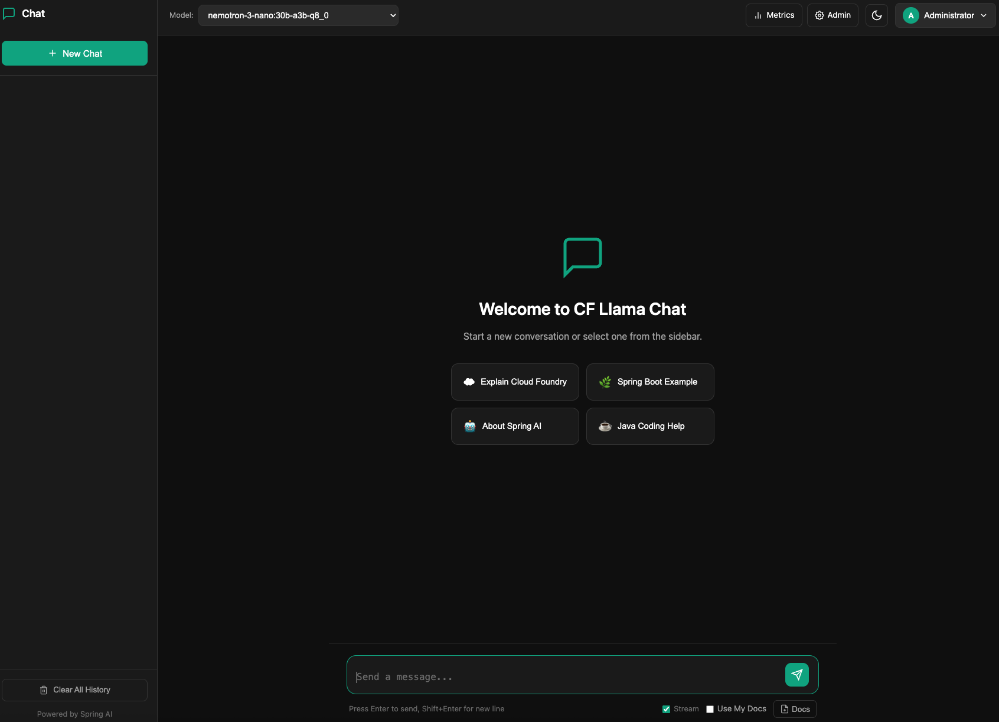
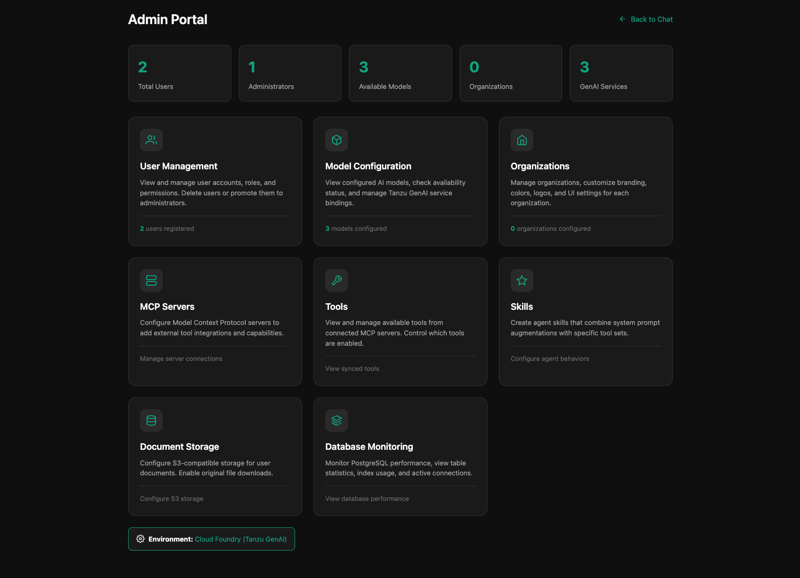
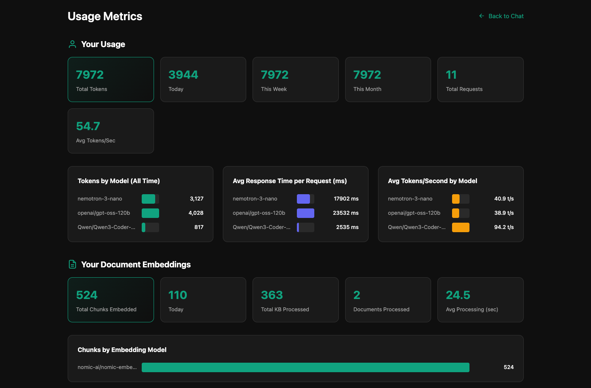

# 🦙 CF Llama Chat

```
   ██████╗███████╗    ██╗     ██╗      █████╗ ███╗   ███╗ █████╗
  ██╔════╝██╔════╝    ██║     ██║     ██╔══██╗████╗ ████║██╔══██╗
  ██║     █████╗      ██║     ██║     ███████║██╔████╔██║███████║
  ██║     ██╔══╝      ██║     ██║     ██╔══██║██║╚██╔╝██║██╔══██║
  ╚██████╗██║         ███████╗███████╗██║  ██║██║ ╚═╝ ██║██║  ██║
   ╚═════╝╚═╝         ╚══════╝╚══════╝╚═╝  ╚═╝╚═╝     ╚═╝╚═╝  ╚═╝
                     🚀 Enterprise AI Chat for Cloud Foundry
```

> A modern, enterprise-ready chat application built with **Spring Boot** and **Spring AI**, designed for **Tanzu Platform** and **Cloud Foundry** deployments. Inspired by [open-webui](https://github.com/open-webui/open-webui).

---

## 📸 Screenshots

<!-- Add your screenshots here -->
| Chat Interface | Admin Portal | Metrics Dashboard |
|:---:|:---:|:---:|
|  |  |  |

---

## 🏗️ Architecture

```
+---------------------------------------------------------------------+
|                   TANZU PLATFORM / CLOUD FOUNDRY                    |
+---------------------------------------------------------------------+
|                                                                     |
|  +-----------+    +---------------------------------------------+   |
|  |           |    |            CF LLAMA CHAT APP                |   |
|  |   Users   |--->|  +---------------------------------------+  |   |
|  |           |    |  |          Spring Boot 3.4              |  |   |
|  |           |    |  |  +----------+  +----------+           |  |   |
|  +-----------+    |  |  |   Chat   |  |  Admin   |           |  |   |
|                   |  |  | Service  |  |  Portal  |           |  |   |
|                   |  |  +----+-----+  +----+-----+           |  |   |
|                   |  |       +-------------+                 |  |   |
|                   |  |              |                        |  |   |
|                   |  |  +-----------v-----------+            |  |   |
|                   |  |  |    Spring AI 1.1      |            |  |   |
|                   |  |  |  +----------------+   |            |  |   |
|                   |  |  |  | GenAI Locator  |   |            |  |   |
|                   |  |  |  +-------+--------+   |            |  |   |
|                   |  |  +-----------|-----------+            |  |   |
|                   |  +--------------|------------------------+  |   |
|                   +-----------------|---------------------------+   |
|                                     |                               |
|  +----------------------------------v----------------------------+  |
|  |                    VCAP_SERVICES BINDINGS                     |  |
|  |                                                               |  |
|  |  +---------------------------------------------------------+  |  |
|  |  |                   tanzu-all-models                      |  |  |
|  |  |             (GenAI Multi-Model Binding)                 |  |  |
|  |  |  +-------------+ +-------------+ +-------------+        |  |  |
|  |  |  | Chat        | | Chat        | | Embedding   |        |  |  |
|  |  |  | GPT-OSS-120B| | Qwen3-30B   | | Nomic-Embed |        |  |  |
|  |  |  +-------------+ +-------------+ +-------------+        |  |  |
|  |  +---------------------------------------------------------+  |  |
|  |                                                               |  |
|  |  +---------------+ +---------------+ +---------------+        |  |
|  |  | PostgreSQL    | | SSO Service   | | MCP Servers   |        |  |
|  |  | + pgvector    | | (p-identity)  | | (optional)    |        |  |
|  |  +---------------+ +---------------+ +---------------+        |  |
|  +---------------------------------------------------------------+  |
|                                                                     |
+---------------------------------------------------------------------+
```

🧑‍💻 **Users** • 💬 **Chat Models** • 🔢 **Embeddings** • 🗄️ **PostgreSQL** • 🔐 **SSO** • 🛠️ **MCP**

---

## 🌟 Key Features

### 🤖 Tanzu GenAI Integration

```
+==============================================================+
|  AUTOMATIC MODEL DISCOVERY                                   |
|                                                              |
|  tanzu-all-models --------> GenAI Locator                    |
|       |                          |                           |
|       |                          v                           |
|       |                +-----------------+                   |
|       |                | getModelNames   |                   |
|       |                | ByCapability()  |                   |
|       |                +--------+--------+                   |
|       |                         |                            |
|       v                         v                            |
|  +---------+  +---------+  +---------+                       |
|  |  CHAT   |  |  CHAT   |  |EMBEDDING|                       |
|  | Model 1 |  | Model 2 |  |  Model  |                       |
|  +---------+  +---------+  +---------+                       |
+==============================================================+
```

- **🔄 Multi-Model Binding**: Single `tanzu-all-models` service discovers all available models
- **📡 Dynamic Discovery**: Uses `GenaiLocator.getModelNamesByCapability()` for runtime discovery
- **🔙 Backward Compatible**: Still supports individual model service bindings
- **🧠 Smart Routing**: Automatically routes to correct model based on capability (CHAT vs EMBEDDING)

### 📄 Document RAG (Retrieval-Augmented Generation)

```
+----------+     +--------------+     +--------------+     +--------------+
|   PDF    |     |   Chunking   |     |  Embedding   |     |   PgVector   |
|   Word   |---->|  (350 tokens)|---->| nomic-embed  |---->|    Store     |
|   Text   |     |              |     |              |     |              |
+----------+     +--------------+     +--------------+     +--------------+
                                                                  |
                                                                  v
+----------+     +--------------+     +--------------+     +--------------+
|          |     |   Semantic   |     |   Context    |     |   Enhanced   |
|  Query   |---->|    Search    |---->|  Injection   |---->|   Response   |
|          |     |   (Top-K)    |     |              |     |              |
+----------+     +--------------+     +--------------+     +--------------+
```

📄 **Documents** ➡️ ✂️ **Chunk** ➡️ 🔢 **Embed** ➡️ 🗄️ **Store** ➡️ 🔍 **Search** ➡️ 💬 **Response**

- **📤 User Document Upload**: PDF, Word, text files supported
- **✂️ Smart Chunking**: Automatic chunking optimized for embedding model limits
- **🔍 Vector Search**: Semantic search using PostgreSQL pgvector
- **🔒 Per-User Isolation**: Each user's documents are private

### 🛠️ MCP (Model Context Protocol)

```
+-----------------------------------------------------------+
|                      MCP Integration                      |
|                                                           |
|  +-------------+    +-------------+    +-------------+    |
|  |     SSE     |    |    STDIO    |    |   Custom    |    |
|  |   Server    |    |   Server    |    |    Tools    |    |
|  +------+------+    +------+------+    +------+------+    |
|         |                  |                  |           |
|         +------------------+------------------+           |
|                            |                              |
|                            v                              |
|                   +----------------+                      |
|                   |  Tool Registry |                      |
|                   +----------------+                      |
|                            |                              |
|                            v                              |
|             +------------------------------+              |
|             |  Skills = Tools + Prompts    |              |
|             +------------------------------+              |
+-----------------------------------------------------------+
```

🌐 **SSE** • 📟 **STDIO** • 🔧 **Custom Tools** • 📋 **Registry** • 💡 **Skills**

---

## 🚀 Tanzu Platform Deployment

### Quick Start

```bash
# 1️⃣ Build the application
mvn clean package -DskipTests

# 2️⃣ Create services
cf create-service postgres on-demand-postgres-db cf-llama-chat-db
cf create-service genai multi-model tanzu-all-models

# 3️⃣ Deploy!
cf push
```

### Default Credentials

| | |
|---|---|
| **Username** | `admin` |
| **Password** | `Tanzu123!` |

> ⚠️ **Change the default password after first login!** Override via `app.admin.default-username` and `app.admin.default-password` properties.

### Service Bindings

| Service | Plan | Purpose |
|---------|------|---------|
| `genai` | `multi-model` | 🤖 All AI models (chat + embedding) |
| `postgres` | `on-demand-postgres-db` | 🗄️ Data + pgvector embeddings |
| `p-identity` | `standard` | 🔐 SSO/OAuth2 (optional) |

### manifest.yml

```yaml
applications:
  - name: cf-llama-chat
    memory: 1G
    instances: 1
    buildpacks:
      - java_buildpack_offline
    env:
      SPRING_PROFILES_ACTIVE: cloud
    services:
      - cf-llama-chat-db
      - tanzu-all-models
      # Individual model bindings (use if not using multi-model plan)
      # - tanzu-nomic-embed-text-v2-moe
      # - tanzu-gpt-oss-120b
      - cf-llama-chat-sso
```

---

## 📊 Metrics & Monitoring

```
+----------------------------------------------------------+
|                      Usage Metrics                       |
|                                                          |
|  +----------------------------------------------------+  |
|  |  Chat Metrics                                      |  |
|  |    - Total Tokens: 1,234,567                       |  |
|  |    - Avg Response Time: 2.3s                       |  |
|  |    - Tokens/Second: 45.2                           |  |
|  |    - Total Requests: 5,432                         |  |
|  +----------------------------------------------------+  |
|                                                          |
|  +----------------------------------------------------+  |
|  |  Embedding Metrics                                 |  |
|  |    - Documents Processed: 234                      |  |
|  |    - Total Chunks: 12,456                          |  |
|  |    - Characters Embedded: 4.5M                     |  |
|  |    - Avg Processing Time: 1.2s                     |  |
|  +----------------------------------------------------+  |
+----------------------------------------------------------+
```

💬 **Chat**: tokens, latency, throughput • 📄 **Embeddings**: documents, chunks, processing

---

## 🎨 Multi-Tenancy & Theming

```
+-----------------------------------------------------------+
|                       Organizations                       |
|                                                           |
|   /acme-corp          /startup-xyz        /enterprise     |
|  +-------------+     +-------------+     +-------------+  |
|  |   Custom    |     |   Custom    |     |   Custom    |  |
|  |   Theme     |     |   Theme     |     |   Theme     |  |
|  |             |     |             |     |             |  |
|  |   - Logo    |     |   - Logo    |     |   - Logo    |  |
|  |   - Colors  |     |   - Colors  |     |   - Colors  |  |
|  |   - Fonts   |     |   - Fonts   |     |   - Fonts   |  |
|  +-------------+     +-------------+     +-------------+  |
+-----------------------------------------------------------+
```

🏢 **Orgs** • 🖼️ **Logo** • 🎭 **Colors** • ✏️ **Fonts** • 🎨 **Custom CSS**

- **🏷️ Slug-Based Routing**: Access via `/{org-slug}` URLs
- **🎨 Full Theming**: Colors, fonts, border radius, custom CSS
- **🖼️ Custom Branding**: Logo, favicon, welcome message

---

## 🔐 Authentication

```
                    +-----------------+
                    |   Auth Options  |
                    +--------+--------+
                             |
           +-----------------+-----------------+
           |                 |                 |
           v                 v                 v
    +--------------+  +--------------+  +--------------+
    |    Local     |  |  SSO/OAuth   |  |  Invitation  |
    |   Username   |  |   via UAA    |  |    Codes     |
    |   Password   |  |  (optional)  |  |  (optional)  |
    +--------------+  +--------------+  +--------------+
```

🔑 **Local** • 🏢 **SSO/OAuth** • 🎫 **Invitation Codes**

- **👤 Local Auth**: Secure username/password with bcrypt hashing
- **🔐 Enterprise SSO**: OAuth2 via Cloud Foundry p-identity service
- **👑 Role-Based Access**: Admin and User roles
- **🔑 Password Management**: Admin reset & user change password

---

## 🛡️ Admin Portal

```
+-----------------------------------------------------------+
|                       ADMIN PORTAL                        |
+-----------------------------------------------------------+
|                                                           |
|  +-----------+ +-----------+ +-----------+ +-----------+  |
|  |   Users   | |  Models   | |   Tools   | |  Skills   |  |
|  +-----------+ +-----------+ +-----------+ +-----------+  |
|                                                           |
|  +-----------+ +-----------+ +-----------+ +-----------+  |
|  |    MCP    | |   Orgs    | |  Storage  | |  Metrics  |  |
|  +-----------+ +-----------+ +-----------+ +-----------+  |
|                                                           |
+-----------------------------------------------------------+
```

👥 **Users** • 🤖 **Models** • 🛠️ **Tools** • 💡 **Skills** • 🔌 **MCP** • 🏢 **Orgs** • 📦 **Storage** • 📊 **Metrics**

---

## 🔧 Tech Stack

| Layer | Technology |
|-------|------------|
| ☕ Backend | Spring Boot 3.4, Spring AI 1.1 |
| 🎨 Frontend | Thymeleaf, Vanilla JS, CSS3 |
| 🗄️ Database | PostgreSQL + pgvector |
| 🤖 AI | Tanzu GenAI, OpenAI, Ollama |
| 📄 Documents | Apache Tika, PDF Box |
| 📦 Storage | S3-compatible (optional) |

---

## ⚙️ Configuration

### Environment Variables

| Variable | Description | Default |
|----------|-------------|---------|
| `SPRING_PROFILES_ACTIVE` | Active profile | `cloud` |
| `DOCUMENT_CHUNK_SIZE` | Chunk size for embeddings | `350` |
| `EMBEDDING_DIMENSIONS` | Vector dimensions | `512` |
| `RAG_TOP_K` | Top-K results for RAG | `5` |
| `APP_AUTH_SECRET` | Invitation code | - |

---

## 📚 API Reference

<details>
<summary>💬 Chat APIs</summary>

| Method | Endpoint | Description |
|--------|----------|-------------|
| `POST` | `/api/chat/stream` | Streaming chat (SSE) |
| `POST` | `/api/chat` | Non-streaming chat |
| `GET` | `/api/chat/models` | List available models |
</details>

<details>
<summary>📄 Document APIs</summary>

| Method | Endpoint | Description |
|--------|----------|-------------|
| `POST` | `/api/documents/upload` | Upload document |
| `GET` | `/api/documents` | List documents |
| `DELETE` | `/api/documents/{id}` | Delete document |
| `GET` | `/api/documents/search` | Semantic search |
</details>

<details>
<summary>👑 Admin APIs</summary>

| Method | Endpoint | Description |
|--------|----------|-------------|
| `GET` | `/api/admin/users` | List users |
| `POST` | `/api/admin/mcp/servers` | Create MCP server |
| `GET` | `/api/admin/tools` | List tools |
| `POST` | `/api/admin/skills` | Create skill |
</details>

---

## 🧪 Local Development

<details>
<summary>Click to expand local development instructions</summary>

### Prerequisites

- ☕ Java 21+
- 📦 Maven 3.8+
- 🔑 OpenAI API Key or Ollama

### Setup

```bash
# Clone the repo
git clone https://github.com/nkuhn-vmw/cf-llama-chat.git
cd cf-llama-chat

# Set environment variables
export OPENAI_API_KEY=your-api-key

# Or for Ollama:
export CHAT_PROVIDER=ollama
export OLLAMA_BASE_URL=http://localhost:11434

# Run the application
mvn spring-boot:run

# Open http://localhost:8080
```

### Local Configuration

| Variable | Description | Default |
|----------|-------------|---------|
| `OPENAI_API_KEY` | OpenAI API key | - |
| `OPENAI_MODEL` | OpenAI model | `gpt-4o-mini` |
| `CHAT_PROVIDER` | AI provider | `openai` |
| `OLLAMA_BASE_URL` | Ollama URL | `http://localhost:11434` |
| `OLLAMA_MODEL` | Ollama model | `llama3.2` |

</details>

---

## 📁 Project Structure

<details>
<summary>Click to expand project structure</summary>

```
src/main/java/com/example/cfchat/
├── 🚀 CfLlamaChatApplication.java
├── 🔐 auth/
├── ⚙️ config/
│   ├── GenAiConfig.java          # Tanzu GenAI multi-model support
│   ├── VectorStoreConfig.java    # Embedding & pgvector
│   └── SecurityConfig.java
├── 🎮 controller/
│   ├── ChatController.java
│   ├── DocumentController.java
│   ├── AdminController.java
│   └── ...
├── 📦 model/
├── 🗄️ repository/
└── 🔧 service/
    ├── ChatService.java
    ├── DocumentEmbeddingService.java
    └── ...
```

</details>

---

## 📜 License

MIT License - Copyright (c) 2026 Kuhn-Labs

See [LICENSE](LICENSE) for details.

---

<div align="center">

**Built with ❤️ for Tanzu Platform**

```
 _____                         _    ___
|_   _|_ _ _ __  _____   _    / \  |_ _|
  | |/ _` | '_ \|_  / | | |  / _ \  | |
  | | (_| | | | |/ /| |_| | / ___ \ | |
  |_|\__,_|_| |_/___|\__,_|/_/   \_\___|
```

</div>
