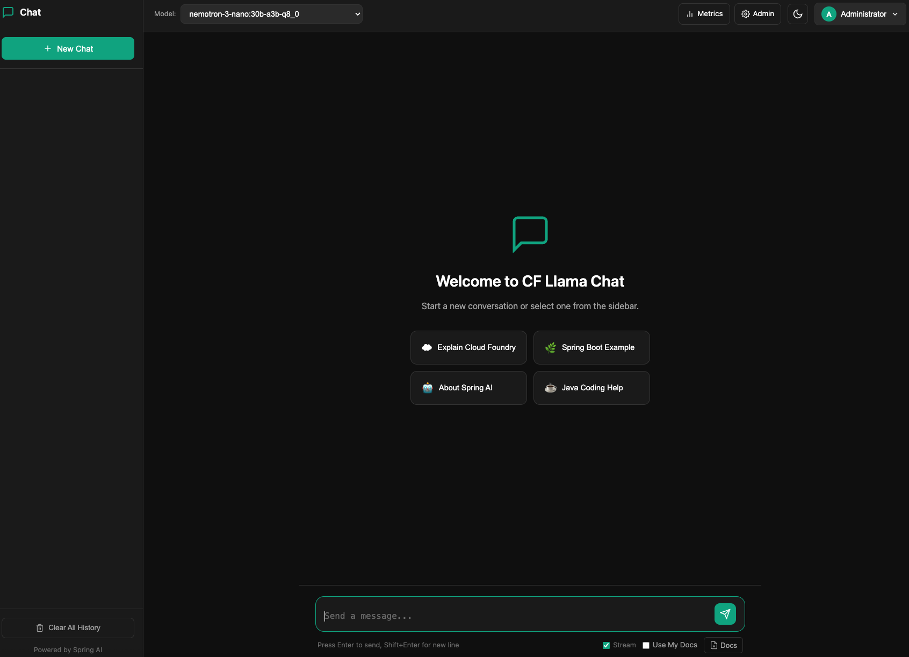
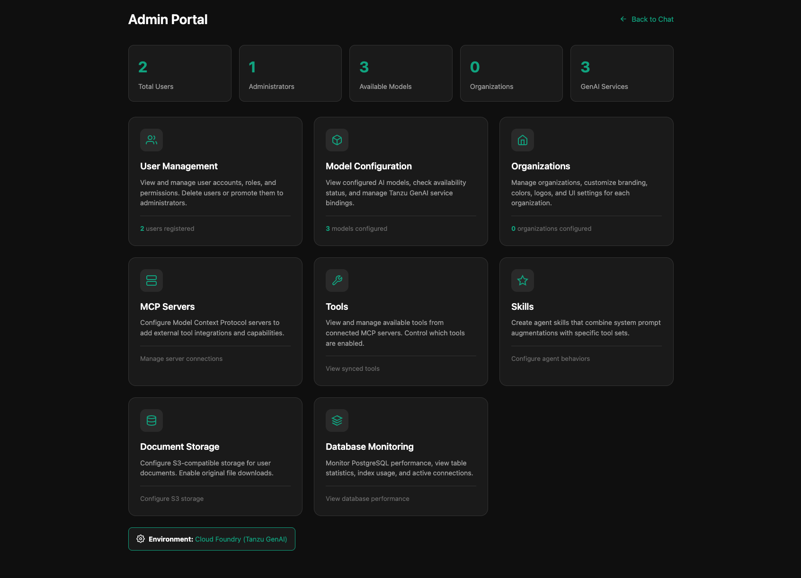
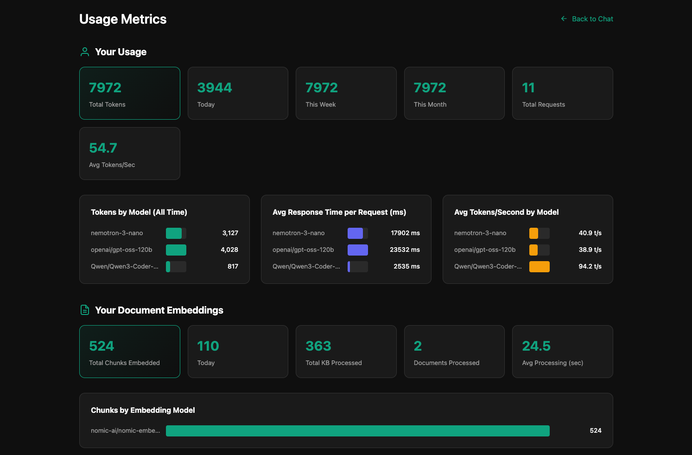

# 🦙 CF Llama Chat

```
   ██████╗███████╗    ██╗     ██╗      █████╗ ███╗   ███╗ █████╗
  ██╔════╝██╔════╝    ██║     ██║     ██╔══██╗████╗ ████║██╔══██╗
  ██║     █████╗      ██║     ██║     ███████║██╔████╔██║███████║
  ██║     ██╔══╝      ██║     ██║     ██╔══██║██║╚██╔╝██║██╔══██║
  ╚██████╗██║         ███████╗███████╗██║  ██║██║ ╚═╝ ██║██║  ██║
   ╚═════╝╚═╝         ╚══════╝╚══════╝╚═╝  ╚═╝╚═╝     ╚═╝╚═╝  ╚═╝
                     🚀 Enterprise AI Chat for Cloud Foundry
```

> A modern, enterprise-ready chat application built with **Spring Boot 3.4** and **Spring AI 1.1**, designed for **Tanzu Platform** and **Cloud Foundry** deployments. Inspired by [open-webui](https://github.com/open-webui/open-webui).
>
> Multi-model chat through the Tanzu GenAI tile, agent-curated **LLM Wiki**, per-turn **thinking-level** control, Document RAG, MCP tool servers, multi-tenant organizations, and a full admin portal — all without leaving the OpenAI-compatible API surface.

---

## 📸 Screenshots

| Chat Interface | Admin Portal | Metrics Dashboard |
|:---:|:---:|:---:|
|  |  |  |

---

## 🏗️ Architecture

```
+---------------------------------------------------------------------+
|                   TANZU PLATFORM / CLOUD FOUNDRY                    |
+---------------------------------------------------------------------+
|                                                                     |
|  +-----------+    +---------------------------------------------+   |
|  |           |    |            CF LLAMA CHAT APP                |   |
|  |   Users   |--->|  +---------------------------------------+  |   |
|  |           |    |  |          Spring Boot 3.4              |  |   |
|  |           |    |  |  +----------+  +-------+  +--------+  |  |   |
|  +-----------+    |  |  | Chat +   |  | Wiki  |  | Admin  |  |  |   |
|                   |  |  | SSE      |  | Tools |  | Portal |  |  |   |
|                   |  |  +----+-----+  +---+---+  +---+----+  |  |   |
|                   |  |       +-----------+----------+        |  |   |
|                   |  |                   |                   |  |   |
|                   |  |  +----------------v---------------+   |  |   |
|                   |  |  |          Spring AI 1.1         |   |  |   |
|                   |  |  |  +------------------+          |   |  |   |
|                   |  |  |  |  GenAI Locator   |          |   |  |   |
|                   |  |  |  +---------+--------+          |   |  |   |
|                   |  |  +------------|-------------------+   |  |   |
|                   |  +---------------|-----------------------+  |   |
|                   +------------------|------------------------- +   |
|                                      |                              |
|  +-----------------------------------v---------------------------+  |
|  |                    VCAP_SERVICES BINDINGS                     |  |
|  |                                                               |  |
|  |  +---------------------------------------------------------+  |  |
|  |  |                   tanzu-all-models                      |  |  |
|  |  |              (GenAI Multi-Model Binding)                |  |  |
|  |  |  +-------------+ +-------------+ +-------------+        |  |  |
|  |  |  | gpt-oss:20b | | qwen3:4b    | | nomic-embed |        |  |  |
|  |  |  | chat/reason | | chat        | | embedding   |        |  |  |
|  |  |  +-------------+ +-------------+ +-------------+        |  |  |
|  |  +---------------------------------------------------------+  |  |
|  |                                                               |  |
|  |  +---------------+ +---------------+ +---------------+        |  |
|  |  | PostgreSQL    | | p-identity    | | MCP Servers   |        |  |
|  |  | + pgvector    | | OAuth2 (opt)  | | (optional)    |        |  |
|  |  +---------------+ +---------------+ +---------------+        |  |
|  +---------------------------------------------------------------+  |
|                                                                     |
+---------------------------------------------------------------------+
```

🧑‍💻 **Users** • 💬 **Chat + Wiki** • 🔢 **Embeddings** • 🗄️ **PostgreSQL + pgvector** • 🔐 **SSO** • 🛠️ **MCP**

---

## 🌟 Key Features

### 🤖 Tanzu GenAI Integration

- **🔄 Multi-Model Binding** — single `tanzu-all-models` service discovers every model on the tile via `GenaiLocator.getModelNamesByCapability()`
- **🔙 Backward Compatible** — still supports individual `genai` service bindings and a legacy per-model plan
- **🧠 Smart Routing** — chat requests route to chat-capable models; embeddings route separately; mixed models in the same binding are automatically filtered
- **🔌 External OpenAI-Compatible Bindings** — add any OpenAI-compatible API at runtime through the admin portal; hot-reloaded, secure key storage, optional GenAI Locator config URL for auto-discovery

### 🧠 LLM Wiki (agent-curated knowledge base)

The chat model writes to a **persistent, per-user wiki** during normal conversation via six Spring AI `@Tool` methods. Durable facts, preferences, decisions, and project entities are saved automatically. A Caffeine-cached index block is injected into every system prompt so the assistant stays consistent across sessions.

```
+---------------------------------------------------------------+
|  USER: "i like tacos"                                         |
|                                                               |
|  ASSISTANT: "Got it! Tacos are now on your list..."           |
|    ├─ calls wiki_write(slug="preference/food",                |
|    │                     kind="PREFERENCE", ...)              |
|    └─ [ ▸ Details (1 wiki op) ]                               |
|         ├─ Thinking: the user stated a stable preference...   |
|         └─ WIKI OPS: Saved PREFERENCE preference/food         |
|                      [view] [undo]                            |
|                                                               |
|  (later, in a FRESH conversation)                             |
|  USER: "what's my favorite food?"                             |
|  ASSISTANT: "You've mentioned liking tacos."                  |
|    └─ reached the answer via wiki index block, not via        |
|       chat history                                            |
+---------------------------------------------------------------+
```

- **✍️ Six `@Tool` methods** — `wiki_search`, `wiki_read`, `wiki_write`, `wiki_link`, `wiki_invalidate`, `wiki_index`
- **📚 Page kinds** — `FACT`, `PREFERENCE`, `DECISION`, `CONCEPT`, `ENTITY`, `EVENT`
- **↩️ Undo** — inline undo chip on every write. First-write undo deletes the page; multi-version undo restores prior content
- **📖 History + audit log** — every write, link, undo, and invalidate is versioned and logged, with full revision history
- **🔎 Hybrid search** — vector search over page content via pgvector
- **🗄️ Unified workspace** — browse, search, edit, and review revision history at `/workspace/wiki`
- **🎛️ Two-layer enable/disable** — admin kill switch (`wiki.enabled` system setting) + per-user opt-out in settings
- **🔄 One-shot migration** — legacy `user_notes` + `user_memories` tables automatically migrated to `wiki_page` on first boot, then dropped

### 🎚️ Thinking-Level Control

Per-turn segmented control in the chat input bar: **None / Low / Med / High**. Persisted in user preferences and sent with every chat request.

| Level | Effect | Best for |
|---|---|---|
| **None** | Suppresses reasoning entirely (`/no_think` for Qwen3 family; verbal directive for others) | Fast lookups, simple Q&A |
| **Low** | Brief reasoning, 1–2 sentences | Most everyday questions |
| **Med** | Default reasoning depth | General use |
| **High** | Step-by-step reasoning | Hard problems, planning, code review |

`ThinkingOptionsBuilder` maps the level per-model family (Qwen3 native directive, verbal system-prompt nudge for everything else). Runs cleanly against the Tanzu GenAI tile's OpenAI-compatible proxy.

### 💬 Polished Chat UI

- **🎭 Collapsible Details panel** — default collapsed, per-assistant-message. Contains both the model's internal reasoning (parsed from `<think>...</think>` blocks during streaming) and any wiki operations that fired during the turn
- **💭 Thinking indicator** — pulse animation + "Thinking…" label on the streaming bubble while the model is inside a reasoning block
- **📝 Stream-aware markdown** — debounced rendering at 100 ms during streaming, full re-render on complete
- **🧮 Code + math + artifacts** — syntax highlighting, LaTeX math via KaTeX, sandboxed HTML/SVG artifacts
- **🔗 Streaming RAG URL prefix** — `#https://…` in a user message auto-fetches the page (web) or transcript (YouTube) and injects as context
- **⏱️ Per-message metrics** — TTFT, tokens/sec, total time shown under each response
- **🛡️ CSP-clean** — all JS in external files, no inline handlers, DOMPurify on every markdown-to-HTML path

### 📄 Document RAG

```
+----------+   +--------------+   +--------------+   +--------------+
|   PDF    |   |   Extract    |   |    Chunk     |   |   Embed      |
|   Word   |-->| Tika /       |-->| (350 tokens, |-->| nomic-embed  |
|   Text   |   | Docling /    |   |  100 overlap)|   |              |
|   HTML   |   | Azure DocInt |   |              |   |              |
+----------+   +--------------+   +--------------+   +--------------+
                                                            |
                                                            v
+----------+   +--------------+   +--------------+   +--------------+
|          |   |  Semantic    |   |  Full-doc or |   |  PgVector    |
|  Query   |-->|  Search      |-->|  snippet     |-->|  Store       |
|          |   |  (top-k)     |   |  retrieval   |   |              |
+----------+   +--------------+   +--------------+   +--------------+
```

- **📤 Upload** — PDF, Word, text, HTML, more via Apache Tika. Optional Docling and Azure Document Intelligence extractors for better layout handling
- **📦 Pluggable storage** — local filesystem, S3-compatible, Azure Blob, Google Cloud Storage
- **✂️ Smart chunking** — default 350 tokens / 100 overlap, tuned for nomic-embed's context window
- **🔍 Two retrieval modes** — `snippet` (matched chunks only) or `full` (all chunks from matched parent docs, grouped)
- **🔒 Per-user isolation** — each user's documents are private
- **🔀 Hybrid search** — vector + keyword combined for better recall on technical content

### 🛠️ MCP (Model Context Protocol)

- **🌐 Transport support** — SSE and streamable HTTP; routed by `McpClientFactory` based on `McpTransportType`
- **📡 Auto-discovery** — scans `VCAP_SERVICES` for the `mcpSseURL` credentials key or user-provided services tagged `mcpSseURL`
- **🔧 Tools + Skills** — MCP tools can be bundled into Skills (tools + prompt augmentation) for reusable agent behaviors
- **🛡️ Per-user permissions** — access rules + user groups control which tools a user can call

### 👥 Multi-Tenancy & Organizations

- **🏷️ Slug-based routing** — access an org at `/{org-slug}`
- **🎨 Full theming** — colors, fonts, border radius, custom CSS, logo, favicon, welcome message per-org
- **👥 User groups** — role-based grouping with fine-grained permissions
- **🔑 Model access rules** — restrict specific models to users or groups
- **🔐 SCIM 2.0** — user provisioning endpoint for enterprise identity providers

### 🧰 Workspace Features

All user-facing features grouped at `/workspace`:

| Feature | Purpose |
|---|---|
| 🧠 **Wiki** | Agent-curated knowledge base (NEW — replaces Notes + Memory) |
| 💬 **Channels** | Group chat channels with persistent messages |
| 📝 **Prompts** | Reusable prompt presets with `{{variable}}` templates |
| 🛠️ **Tools** | Browse available MCP tools and toggle per-user access |
| 📄 **Documents** | Upload, manage, and search personal document library |
| ❓ **Help** | In-app guides for every feature |

### 🛡️ Admin Portal

All admin features grouped at `/admin`:

| Page | Purpose |
|---|---|
| ⚙️ **Settings** | Site config, feature flags (`wiki.enabled`, `feature.rag.enabled`, etc.), rate limits, maintenance mode |
| 👥 **Users** | Create, edit, reset passwords, manage roles, invitation codes |
| 👨‍👩‍👧 **User Groups** | Group-based access control |
| 🏢 **Organizations** | Slug, theme, branding, SCIM config |
| 🤖 **Models** | View discovered models, set access rules, configure defaults |
| 🔌 **External Bindings** | Add/edit/remove OpenAI-compatible API endpoints at runtime |
| 🛠️ **Tools** | Manage custom and MCP-discovered tools |
| 💡 **Skills** | Bundle tools + prompt augmentation into reusable agent behaviors |
| 🔌 **MCP Servers** | Configure SSE and streamable-HTTP MCP endpoints |
| 💾 **Storage** | Configure document storage backend (local / S3 / Azure / GCS) |
| 🔔 **Banners** | Site-wide notification banners |
| 🪝 **Webhooks** | Outbound event notifications |
| 🗄️ **Database** | DB stats, connection pool health |

### 📊 Metrics & Observability

- **📈 Usage metrics** — per-user, per-model: token counts, TTFT, tokens/sec, total response time
- **🔍 Embedding metrics** — documents processed, chunks, characters, processing time
- **👁️ Active user tracking** — real-time session tracking via `ActiveUserTracker`
- **📡 OpenTelemetry** — Micrometer Observation API, OTLP export, trace context filter
- **🩺 Actuator** — `/actuator/health`, `/actuator/info`, `/actuator/prometheus` (when enabled)
- **💻 Admin dashboard** — live charts at `/admin/metrics`

### 🔐 Authentication & Security

```
                    +-----------------+
                    |   Auth Options  |
                    +--------+--------+
                             |
       +--------+------------+-----------+--------+
       |        |            |           |        |
       v        v            v           v        v
   +------+ +------+    +--------+   +------+ +------+
   |Local |  | SSO  |   |  LDAP  |   |Invite| | SCIM |
   |bcrypt|  | UAA  |   | AD/389 |   | Code | |2.0   |
   +------+ +------+    +--------+   +------+ +------+
```

- **🔑 Local auth** — bcrypt password hashing, admin reset, user self-service change
- **🏢 Enterprise SSO** — OAuth2 via CF `p-identity` service (bound manually; see CLAUDE.md)
- **📁 LDAP** — optional LDAP/AD backend, configurable via `auth.ldap.*`
- **🎫 Invitation codes** — gate registration with `app.auth.secret` / `APP_AUTH_SECRET`
- **👑 RBAC** — Admin and User roles + per-group permissions
- **🛡️ CSP** — strict `script-src 'self'`; all JS external; no inline handlers
- **🚦 Rate limiting** — configurable per-user request throttling via `RateLimitService`
- **🧪 Prompt injection detection** — heuristic scanning on every user message
- **🔄 Redis session store** — optional, enabled when `REDIS_HOST` is set

---

## 🚀 Quick Start — Tanzu Platform

```bash
# 1️⃣ Build the application
./mvnw clean package -DskipTests

# 2️⃣ Create services
cf create-service postgres on-demand-postgres-db enterprise-chat-db
cf create-service genai tanzu-all-models enterprise-chat-genai

# 3️⃣ Wait for services to finish provisioning
cf services   # wait until both show "create succeeded"

# 4️⃣ Deploy
cf push -f manifest.yml

# 5️⃣ (Optional) Bind SSO manually after the app name stabilizes
cf create-service p-identity uaa enterprise-chat-sso
cf bind-service enterprise-chat-prod enterprise-chat-sso
cf restage enterprise-chat-prod
```

### 🔐 Admin Password & Auth Secret Setup

> **TL;DR** — don't put these values in `manifest.yml` (it's in git). Either let the app generate a password on first boot, or set them with `cf set-env` after pushing. The app refuses to start on the `cloud` profile if you use a known-weak value.

#### What these two variables actually do

They sound similar, but they are **completely different** things:

| | `APP_ADMIN_DEFAULT_PASSWORD` | `APP_AUTH_SECRET` |
|---|---|---|
| **Purpose** | Initial password for the bootstrap `admin` user | Invitation code for self-registration |
| **When it's used** | **Only on first boot** — when the `users` table is empty. Ignored afterwards. | Every registration attempt, *only if* `APP_REQUIRE_INVITATION=true` |
| **Who types it** | The `admin` user at first login | Each new user registering at `/register` |
| **If unset** | A random 16-char password is generated and printed to `cf logs` | Self-registration is open (no gate) |
| **Changing it later** | Does nothing — change the admin's password through the UI instead | Immediate; next registrant needs the new value |

#### The weak-value guard

On the `cloud` profile (auto-activated in CF), `SecurityStartupValidator` refuses to start the app if either variable matches a well-known default:

| Variable | Blocked values |
|---|---|
| `APP_ADMIN_DEFAULT_PASSWORD` | `Tanzu123`, `tanzu123`, `admin`, `password`, `changeme` |
| `APP_AUTH_SECRET` | `changeme`, `changeme-cdc-wiki` |

The failure is only visible in `cf logs <app> --recent` — `cf push` just reports `All instances crashed / FAILED`. Grep for `Startup refused:`:

```
ERROR c.e.c.config.SecurityStartupValidator :
  Startup refused: APP_ADMIN_DEFAULT_PASSWORD is set to a known-weak value.
  Rotate via `cf set-env <app> APP_ADMIN_DEFAULT_PASSWORD <strong-value>` ...
```

#### ✅ Recommended: let the app generate the password

```bash
cf push -f manifest.yml
cf logs enterprise-chat-prod --recent | grep -A1 "Generated admin password"
# ================================================================
#   Generated admin password: 4f8a2e9c1d7b3a5e
#   Change this immediately after first login!
# ================================================================
```

Log in with `admin` + that password, then change it via the UI (profile → change password). The env var is no longer needed after this.

#### ✅ Alternative: pin a strong password before first start

```bash
cf push -f manifest.yml --no-start
cf set-env enterprise-chat-prod APP_ADMIN_DEFAULT_PASSWORD "$(openssl rand -base64 24)"
cf start enterprise-chat-prod
```

Or, if you need to capture the value somewhere:

```bash
ADMIN_PW="$(openssl rand -base64 24)"
echo "$ADMIN_PW" > ~/.ent-chat-admin-pw   # save somewhere safe, chmod 600
cf set-env enterprise-chat-prod APP_ADMIN_DEFAULT_PASSWORD "$ADMIN_PW"
cf restart enterprise-chat-prod
```

#### ✅ If you really want manifest-driven config

Use CF's built-in variable substitution with a **gitignored** vars file — never commit the real value:

```yaml
# manifest.yml — committed to git
env:
  APP_ADMIN_DEFAULT_PASSWORD: ((admin_password))
  APP_AUTH_SECRET: ((auth_secret))
```

```yaml
# secrets.yml — add to .gitignore, chmod 600
admin_password: H3re-is-a-strong-value-2026
auth_secret: and-a-different-strong-value-xyz
```

```bash
echo "secrets.yml" >> .gitignore
cf push -f manifest.yml --vars-file secrets.yml
```

#### 🚫 Common mistakes

| What people try | What happens | Fix |
|---|---|---|
| Hardcoding the password in `manifest.yml` (committed to git) | Works, but leaks the secret into git history | Use `--vars-file` or `cf set-env` |
| Setting `APP_ADMIN_DEFAULT_PASSWORD: Tanzu123` | Validator refuses to start — "Startup refused: known-weak value" | Use a strong value |
| Setting `APP_ADMIN_DEFAULT_PASSWORD` *after* the admin user exists | No effect — it's inert after first boot | Change the password through the UI |
| Using unquoted password with YAML special chars (e.g. `P@ssw0rd!`) | YAML parser may misinterpret `!`/`@`/`#`/`&`/`*` | Single-quote the value: `APP_ADMIN_DEFAULT_PASSWORD: 'P@ssw0rd!'` |
| Setting `APP_AUTH_SECRET` but forgetting `APP_REQUIRE_INVITATION=true` | Invitation code is ignored — anyone can register | Set both, or unset `APP_AUTH_SECRET` |
| Expecting `cf push` to tell you why the app crashed | It doesn't — only says `FAILED` | Always `cf logs <app> --recent` after a crashed push |

### Service Bindings

| Service | Plan | Required | Purpose |
|---------|------|:---:|---------|
| `postgres` | `on-demand-postgres-db` | ✅ | Data + pgvector embeddings |
| `genai` | `tanzu-all-models` | ✅ | Chat + embedding models |
| `p-identity` | `uaa` | ⬜ | SSO / OAuth2 (bind manually, not via manifest) |
| `enterprise-mcp-gateway` | any | ⬜ | Optional MCP tool servers |

### Two manifests, two app names

| Manifest | App name | Binds |
|---|---|---|
| `manifest.yml` | `enterprise-chat-prod` | `enterprise-chat-db` + `enterprise-chat-genai` (manual / local) |
| `manifest-ci.yml` | `cf-llama-chat` | Individual model services (CI blue-green workflow) |

> ⚠️ **SSO is intentionally omitted from both manifests.** Binding `p-identity` via manifest during a CI blue-green push re-registers the OAuth client and invalidates the existing one. Bind manually once after the app name stabilizes.

---

## 🔧 Tech Stack

| Layer | Technology |
|-------|------------|
| ☕ **Backend** | Spring Boot 3.4, Spring AI 1.1, Java 21 |
| 🎨 **Frontend** | Thymeleaf + vanilla JS + CSS3 (zero Node deps) |
| 🗄️ **Database** | PostgreSQL 15+ with pgvector extension |
| 🤖 **AI** | Tanzu GenAI (primary), OpenAI, Ollama, any OpenAI-compatible API |
| 🔢 **Embeddings** | nomic-embed-text-v2-moe (default), 512-dim vectors |
| 📄 **Document extraction** | Apache Tika, PDFBox, optional Docling / Azure Document Intelligence |
| 🔐 **Auth** | Spring Security, OAuth2 client, LDAP, BCrypt |
| 🗃️ **Caching** | Caffeine (local), Redis (cluster, optional) |
| 📦 **Storage** | Local, S3-compatible, Azure Blob, Google Cloud Storage |
| 📊 **Observability** | Micrometer, OpenTelemetry, Actuator |

---

## ⚙️ Configuration

### Runtime environment variables

| Variable | Description | Default |
|----------|-------------|---------|
| `SPRING_PROFILES_ACTIVE` | Active profile | `default` |
| `APP_ADMIN_DEFAULT_PASSWORD` | First-boot admin password (random if unset). See [Admin Password & Auth Secret Setup](#-admin-password--auth-secret-setup). | _(unset)_ |
| `APP_AUTH_SECRET` | Invitation code for self-registration (only enforced when `APP_REQUIRE_INVITATION=true`). See [Admin Password & Auth Secret Setup](#-admin-password--auth-secret-setup). | *(empty)* |
| `APP_REQUIRE_INVITATION` | Require invitation code to register | `false` |
| `CHAT_PROVIDER` | Default chat provider | `openai` |
| `EMBEDDING_MODEL` | Embedding model name | `text-embedding-3-small` |
| `EMBEDDING_DIMENSIONS` | Embedding vector size | `512` |
| `MAX_DOCUMENT_SIZE` | Max upload size in bytes | `104857600` (100 MB) |
| `MAX_DOCUMENTS_PER_USER` | Per-user document quota | `50` |
| `DOCUMENT_CHUNK_SIZE` | Tokens per chunk | `350` |
| `DOCUMENT_CHUNK_OVERLAP` | Chunk overlap tokens | `100` |
| `RAG_TOP_K` | Top-K results for RAG | `5` |
| `MODEL_ACCESS_CONTROL_ENABLED` | Per-model ACLs | `false` |
| `REDIS_HOST` | Enables Redis session store | *(empty)* |
| `OPENAI_API_KEY` | OpenAI direct API key (dev) | *(empty)* |
| `LDAP_ENABLED` | Enable LDAP auth backend | `false` |

### Wiki-specific settings (`application.yml`)

```yaml
app:
  wiki:
    index:
      max-entries: 40              # pages per-user in system-prompt index
      cache-ttl-seconds: 300       # Caffeine TTL (also invalidated on write)
    embedding:
      retry:
        interval-ms: 300000        # background retry interval for failed embeds
    search:
      default-k: 6
      max-k: 20
```

---

## 📚 API Reference

<details>
<summary>💬 Chat APIs</summary>

| Method | Endpoint | Description |
|--------|----------|-------------|
| `POST` | `/api/chat` | Non-streaming chat completion |
| `POST` | `/api/chat/stream` | Streaming chat with SSE; `event: message` for tokens, `event: wiki_op` for live wiki mutations |
| `GET` | `/api/chat/models` | List available chat models from all bindings |
| `GET` | `/api/chat/available-tools` | List MCP tools available to the current user |
| `GET` | `/api/chat/available-skills` | List skills available to the current user |

**`ChatRequest` fields** (selected):

```json
{
  "conversationId": "uuid | null",
  "message": "string (required)",
  "provider": "genai | openai | ollama | external",
  "model": "gpt-oss:20b",
  "skillId": "uuid | null",
  "useDocumentContext": false,
  "ragRetrievalMode": "snippet | full | null",
  "useTools": true,
  "temporary": false,
  "thinkingLevel": "none | low | medium | high"
}
```
</details>

<details>
<summary>🧠 Wiki APIs</summary>

| Method | Endpoint | Description |
|--------|----------|-------------|
| `GET` | `/api/wiki/pages` | List current user's pages; `?kind=…&limit=…` |
| `GET` | `/api/wiki/pages/{id}` | Single page detail |
| `PUT` | `/api/wiki/pages/{id}` | Direct user edit (routes through `WikiService.upsert` so history + log + events all fire) |
| `POST` | `/api/wiki/pages/{id}/undo` | Restore prior version; deletes the page entirely if there's no history |
| `GET` | `/api/wiki/pages/{id}/history` | All revisions of a page |
| `GET` | `/api/wiki/search?q=…&kind=…&k=…` | Vector search over page content |
| `GET` | `/api/wiki/log?limit=…` | Recent wiki activity |
| `GET` | `/api/wiki/feature-status` | `{adminEnabled, userEnabled, effective}` for UI gating |

When admin disables the feature (`SystemSetting wiki.enabled = false`), all endpoints return `404` except `/feature-status`.
</details>

<details>
<summary>📄 Document APIs</summary>

| Method | Endpoint | Description |
|--------|----------|-------------|
| `POST` | `/api/documents/upload` | Upload document (multipart) |
| `GET`  | `/api/documents` | List user's documents |
| `GET`  | `/api/documents/{id}` | Document metadata |
| `DELETE` | `/api/documents/{id}` | Delete document and embeddings |
| `GET`  | `/api/documents/search?q=…` | Semantic + keyword search |
</details>

<details>
<summary>💬 Conversation APIs</summary>

| Method | Endpoint | Description |
|--------|----------|-------------|
| `GET`  | `/api/conversations` | List conversations |
| `GET`  | `/api/conversations/{id}` | Get conversation with messages |
| `POST` | `/api/conversations/{id}/share` | Create shareable link |
| `POST` | `/api/conversations/{id}/export` | Export as Markdown |
| `POST` | `/api/chat-folders` | Create folder |
| `POST` | `/api/tags` | Create conversation tag |
</details>

<details>
<summary>🛠️ Admin APIs</summary>

| Method | Endpoint | Description |
|--------|----------|-------------|
| `GET` | `/api/admin/users` | List users |
| `POST` | `/api/admin/users` | Create user |
| `POST` | `/api/admin/settings` | Set system setting by key |
| `POST` | `/api/admin/mcp/servers` | Create MCP server |
| `GET` | `/api/admin/tools` | List registered tools |
| `POST` | `/api/admin/skills` | Create skill (tools + prompt) |
| `GET` | `/api/admin/external-bindings` | List external API bindings |
| `POST` | `/api/admin/external-bindings` | Add external API binding |
| `PUT` | `/api/admin/external-bindings/{id}` | Update binding |
| `PUT` | `/api/admin/external-bindings/{id}/enabled` | Toggle |
| `POST` | `/api/admin/external-bindings/{id}/reload` | Force re-discover models |
| `GET` | `/api/admin/organizations` | List orgs |
| `POST` | `/api/admin/webhooks` | Register outbound webhook |
</details>

<details>
<summary>👤 User Preferences APIs</summary>

| Method | Endpoint | Description |
|--------|----------|-------------|
| `GET`  | `/api/user/preferences` | Get user preferences blob (theme, language, wikiEnabled, thinkingLevel, etc.) |
| `PUT`  | `/api/user/preferences` | Merge-update preferences |
| `PUT`  | `/api/user/preferences/theme` | Set theme (`light` / `dark` / `oled`) |
| `PUT`  | `/api/user/preferences/background` | Set chat background |
| `PUT`  | `/api/user/preferences/language` | Set UI language (`en` / `es` / `fr` / `de` / `ja` / `zh`) |
| `PUT`  | `/api/user/preferences/rag-retrieval-mode` | `snippet` or `full` |
| `PUT`  | `/api/user/preferences/wiki-enabled` | Toggle per-user wiki opt-out |
</details>

<details>
<summary>🔐 SCIM 2.0 APIs</summary>

| Method | Endpoint | Description |
|--------|----------|-------------|
| `GET`  | `/scim/v2/Users` | List users |
| `POST` | `/scim/v2/Users` | Create user |
| `GET`  | `/scim/v2/Users/{id}` | Get user |
| `PUT`  | `/scim/v2/Users/{id}` | Replace user |
| `DELETE` | `/scim/v2/Users/{id}` | Delete user |
</details>

---

## 🧪 Local Development

<details>
<summary>Click to expand</summary>

### Prerequisites

- ☕ Java 21+
- 📦 Maven 3.8+ (or use the bundled `./mvnw`)
- 🗄️ PostgreSQL 15+ with pgvector extension
- 🤖 OpenAI API key (quickest path) or a local Ollama instance

### Setup

```bash
git clone https://github.com/nkuhn-vmw/cf-llama-chat.git
cd cf-llama-chat

# Set environment for OpenAI
export OPENAI_API_KEY=sk-...

# Or for Ollama
export CHAT_PROVIDER=ollama
export OLLAMA_BASE_URL=http://localhost:11434

./mvnw spring-boot:run
# Open http://localhost:8080
```

### Running tests

```bash
./mvnw test                                         # full suite
./mvnw -Dtest=WikiIntegrationTest test              # wiki round-trip
./mvnw -Dtest=ChatControllerTest test               # chat controller slice
./mvnw -Dtest='*WikiTest,*ChatTest' test            # pattern match
```

### Local environment variables

| Variable | Description | Default |
|----------|-------------|---------|
| `OPENAI_API_KEY` | OpenAI API key | - |
| `OPENAI_MODEL` | OpenAI model | `gpt-4o-mini` |
| `CHAT_PROVIDER` | AI provider | `openai` |
| `OLLAMA_BASE_URL` | Ollama URL | `http://localhost:11434` |
| `OLLAMA_MODEL` | Ollama model | `llama3.2` |
| `SPRING_DATASOURCE_URL` | Postgres URL | `jdbc:postgresql://localhost:5432/cfchat` |
| `SPRING_DATASOURCE_USERNAME` | DB user | `cfchat` |
| `SPRING_DATASOURCE_PASSWORD` | DB password | `cfchat` |

</details>

---

## 📁 Project Structure

<details>
<summary>Click to expand</summary>

```
src/main/java/com/example/cfchat/
├── 🚀 CfLlamaChatApplication.java         # @SpringBootApplication + @EnableAsync + @EnableScheduling
│
├── 🔐 auth/                               # Spring Security, UserService, permission aspect
│
├── ⚙️ config/
│   ├── GenAiConfig.java                   # Tanzu GenAI multi-model discovery
│   ├── VectorStoreConfig.java             # pgvector store + EmbeddingModel
│   ├── SpringAiConfig.java                # ChatClient bean wiring
│   ├── SecurityConfig.java                # Form login, OAuth2 client, CSRF
│   ├── RateLimitInterceptor.java
│   ├── LdapConfig.java
│   ├── SsoConfig.java
│   ├── RedisSessionConfig.java            # optional cluster sessions
│   ├── ObservabilityConfig.java           # Micrometer, tracing
│   └── OpenTelemetryConfig.java
│
├── 🎮 controller/                         # REST + Thymeleaf controllers
│   ├── ChatController.java                # /api/chat, SSE relay for wiki_op events
│   ├── WikiController.java                # /api/wiki/*
│   ├── DocumentController.java
│   ├── ConversationController.java
│   ├── ChatFolderController.java
│   ├── TagController.java
│   ├── ChannelController.java
│   ├── PromptPresetController.java
│   ├── AdminController.java
│   ├── AdminMcpController.java
│   ├── AdminSkillsController.java
│   ├── AdminExternalBindingController.java
│   ├── AdminToolsController.java
│   ├── AdminStorageController.java
│   ├── OrganizationController.java
│   ├── UserGroupController.java
│   ├── UserPreferencesController.java
│   ├── ScimController.java                # SCIM 2.0
│   ├── BannerController.java
│   ├── MetricsController.java
│   ├── UsageController.java
│   ├── ModelKnowledgeController.java
│   ├── WebController.java                 # Thymeleaf page routes
│   └── GlobalExceptionHandler.java
│
├── 📦 model/                              # JPA entities
│   ├── User.java, Role.java, Permission.java
│   ├── Conversation.java, Message.java, ChatFolder.java, ConversationTag.java
│   ├── Channel.java, ChannelMessage.java
│   ├── Skill.java, Tool.java, PromptPreset.java
│   ├── UserDocument.java, DocumentStorageConfig.java
│   ├── McpServer.java, McpTransportType.java
│   ├── ExternalBinding.java
│   ├── Organization.java, UserGroup.java, UserAccess.java
│   ├── ModelAccessRule.java, ModelKnowledge.java, ModelInfo.java
│   ├── NotificationBanner.java, Webhook.java
│   ├── SharedChat.java, SystemSetting.java
│   ├── UsageMetric.java, EmbeddingMetric.java
│   └── wiki/
│       ├── WikiPage.java                  # @OptimisticLock(excluded=true) on embedding fields
│       ├── WikiPageHistory.java
│       ├── WikiLink.java
│       ├── WikiLogEntry.java
│       ├── WikiKind.java, WikiOrigin.java, EmbeddingStatus.java
│
├── 🗄️ repository/                         # Spring Data JPA repos for each entity
│   └── wiki/                              # Wiki repos including WikiPageIndexRow projection
│
├── 🔧 service/
│   ├── ChatService.java                   # buildMessageHistory, thinking-level + tool wiring
│   ├── ThinkingOptionsBuilder.java        # per-model thinking-level translation
│   ├── ConversationService.java
│   ├── DocumentEmbeddingService.java      # pgvector indexing + search
│   ├── DocumentStorageService.java        # abstraction over Local/S3/Azure/GCS
│   ├── LocalStorageService.java, S3StorageService.java
│   ├── AzureBlobStorageService.java, GcsStorageService.java
│   ├── DocumentExtractor.java             # TikaDocumentExtractor / DoclingExtractor / AzureDocIntelExtractor
│   ├── RagPromptBuilder.java, QueryRewriteService.java, HybridSearchService.java
│   ├── YouTubeTranscriptService.java, WebContentService.java, WebSearchService.java
│   ├── McpService.java                    # MCP server lifecycle + constraint migration
│   ├── SkillService.java, ToolService.java
│   ├── ExternalBindingService.java        # hot-reloadable OpenAI-compat bindings
│   ├── OrganizationService.java, UserGroupService.java, UserAccessService.java
│   ├── PermissionService.java, ModelAccessService.java
│   ├── SystemSettingService.java          # broadcasts cache.settings cluster event
│   ├── CacheInvalidationService.java      # cluster-wide cache invalidation
│   ├── ClusterEventService.java           # Redis pub/sub when Redis is bound
│   ├── RateLimitService.java, ContentModerationService.java
│   ├── PromptInjectionDetector.java
│   ├── MetricsService.java, ActiveUserTracker.java
│   ├── ChatExportService.java, ChatSharingService.java, ConfigExportService.java
│   ├── MessageEditService.java, RegenerationService.java
│   ├── MarkdownService.java, TranslationService.java
│   ├── WebhookService.java
│   ├── AsyncChatService.java
│   └── wiki/
│       ├── WikiService.java               # upsert / read / link / invalidate / undo
│       ├── WikiContextLoader.java         # Caffeine-cached index block + @EventListener
│       ├── WikiEmbeddingService.java      # pgvector for wiki pages
│       ├── WikiEmbeddingRetryJob.java     # @Scheduled retry of PENDING/FAILED
│       ├── WikiFeatureService.java        # two-layer enable/disable gate
│       ├── WikiMigrationRunner.java       # one-shot notes+memory -> wiki migration
│       ├── WikiScope.java                 # ToolContext -> userId/conversationId
│       └── SlugUtil.java
│
├── 🛠️ tools/wiki/
│   └── WikiTools.java                     # Six @Tool methods
│
├── 🔌 mcp/
│   ├── McpConfiguration.java, McpDiscoveryService.java
│   ├── McpStartupService.java             # @EventListener ApplicationReadyEvent
│   ├── McpServerService.java, McpToolCallbackCacheService.java
│   ├── McpClientFactory.java              # SSE vs Streamable HTTP routing
│   ├── SessionRecoveringToolCallbackProvider.java
│   └── ProtocolType.java
│
├── 📨 event/
│   └── WikiOpEvent.java                   # ApplicationEvent, consumed by
│                                          #   ChatController (SSE relay)
│                                          #   WikiContextLoader (cache invalidation)
│
└── 📦 dto/
    ├── ChatRequest.java                   # + thinkingLevel field
    ├── ChatResponse.java
    └── wiki/
        ├── WikiPageView.java, WikiSearchHit.java
        ├── WikiIndexEntry.java, WikiOpPayload.java

src/main/resources/
├── templates/
│   ├── index.html                         # Main chat UI w/ thinking selector
│   ├── settings.html                      # User settings
│   ├── admin.html, admin/*.html           # Admin portal
│   ├── workspace.html, workspace/*.html   # Workspace hub: wiki, channels, prompts, tools, documents, help
│   ├── metrics.html
│   └── error/
├── static/
│   ├── js/
│   │   ├── app.js                         # Chat UI, SSE parser, <think> routing, details panel
│   │   ├── workspace-wiki.js              # Wiki workspace page
│   │   ├── settings.js                    # User preferences incl. wiki opt-in
│   │   ├── admin-*.js                     # One file per admin page (CSP: no inline JS)
│   │   └── ...
│   ├── css/style.css                      # Design tokens, thinking selector, details panel
│   └── vendor/marked.min.js, vendor/purify.min.js
└── application.yml                        # app.* config incl. app.wiki.*
```

</details>

---

## 🗺️ Roadmap

- [x] LLM Wiki with agent-curated writes
- [x] Per-turn thinking-level control
- [x] Collapsible details panel with reasoning + wiki ops
- [x] Two-layer enable/disable (admin + user) for wiki feature
- [x] Cluster-aware settings cache invalidation
- [x] Legacy notes + memory migration runner
- [ ] Wiki page tags + cross-links UI
- [ ] Wiki export to Markdown
- [ ] Native `reasoning_effort` passthrough (pending Tanzu GenAI tile enhancement)
- [ ] Separate `delta.reasoning_content` streaming (pending Tanzu GenAI tile enhancement)
- [ ] Multi-modal chat (vision input)
- [ ] Artifact version history
- [ ] Per-organization wiki scoping

---

## 📜 License

MIT License — Copyright (c) 2026 Kuhn-Labs

See [LICENSE](LICENSE) for details.

---

<div align="center">

**Built with ❤️ for Tanzu Platform**

```
 _____                         _    ___
|_   _|_ _ _ __  _____   _    / \  |_ _|
  | |/ _` | '_ \|_  / | | |  / _ \  | |
  | | (_| | | | |/ /| |_| | / ___ \ | |
  |_|\__,_|_| |_/___|\__,_|/_/   \_\___|
```

</div>
